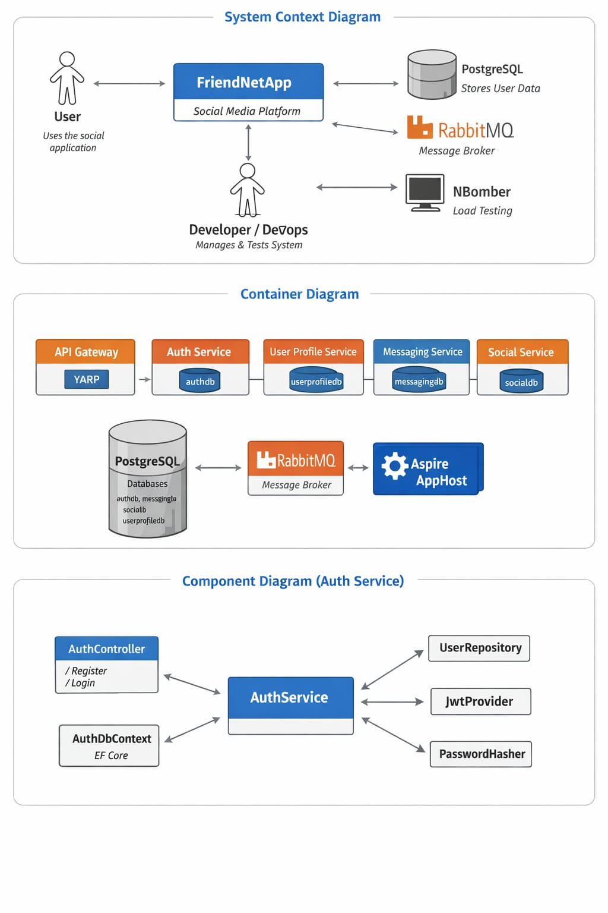
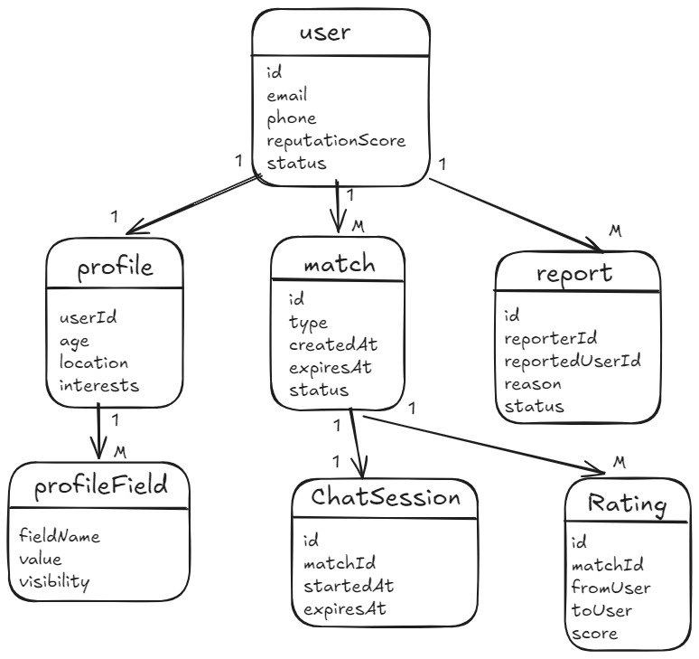
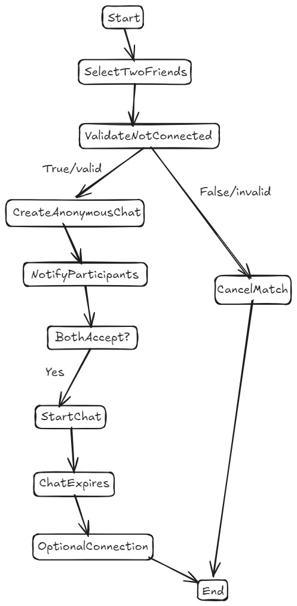
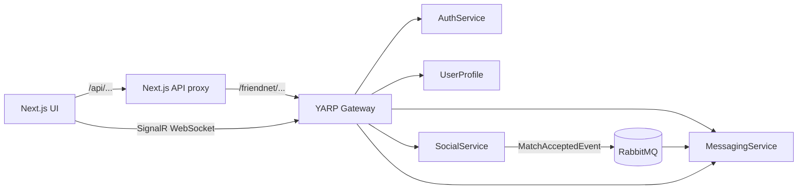

# Find Your Buddy

### Demo Link

https://drive.google.com/file/d/1sxCfAIQ0v_ks2AbpWpC-Uldqd399V7VU/view?usp=drive_link

### Product Vision
FOR adults of all ages WHO want to meet new people or wish to connect two or more friends anonymously based on similar interests, THE "My Next Buddy" app is a social media product THAT allows people to meet other individuals who share the same activities, values, and ideas through a mutual acquaintance.

UNLIKE traditional social media apps that are bombarded with artificial content and exclusively promote the idea of perfection, social validation and superficial interactions, OUR PRODUCT is focused on (but not limited to) connecting people through common friends, or even randomly, based on profile, age, and location, further encouraging communication and helping extend social circles. We want to place an emphasis on today's social difficulties and provide certified support for these issues.

With this in mind, our main targets are both the younger generations who haven't had the chance to connect with people of their kind, and elders who are in need of someone to talk to and share life experiences with.

### Product Features

#### Matching

This is the base functionality of the app and the starting point of our idea: the ability to connect with people you never met and chat with them about common grounds. This feature is implemented in two ways: friends matching and random matching. *Friends matching* represents the ability to match anonymously 2 friends of you (that are not friends with each other); this operation creates a special chat where only these 2 chosen people can chat intimately (for a period of time while they can share some contacts like Instagram or WhatsApp) and become friends on this app, too. *Random matching* is a functionality that allows you to match randomly with people that you share multiple things in common, under certain filters like location, age, gender etc.; this feature is available only one time per day so its importance is not lost in the large palette of matches. One more functionality around matching is the ability to rate the anonymous friend that matched you based on the quality of the interaction - lower rating attracts lower opportunities for matching others. An equivalent for this on random matching would be rating the AI algorithm - this makes your future matches more valuable.

#### Profiles

For our random matching algorithms to work and also to have a starting point for the chatting functionalities, every user must setup a profile with various information: from basic information like name and address to very personal stuff like movies watched, books read and personal best in 5km run. Most of these information can be hidden to all the people (and only available for the algorithm), hidden only for non-friends or accessible by anyone. We will decide on the exact information we will add to profile after we research more on how this can be processed easiest by the AI model we plan to integrate for the matching functionality. Regarding profile customisation, we won't integrate profile pictures since we believe this app must be oriented around pure interactions.

#### Feed

We also intend to implement a feed tailored for each user based on the information from the profile consisting of friends posts, profile updates from friends and possibly some content from the random matching profiles which are not friends. We don't want to work a lot on this feature since keeping the users in our app doesn't match with our app's unwritten principles.

#### Chatting

After a match has been created by the system, a chat is also created instantly just for you two. Because we want to build this app only for connecting people and not long-term chatting or sharing different content, we don't offer support for fancy formatting or persistent messaging. Besides this, on every chat you have the possibility to rate the person you chat with and report it if needed.

### User Scenarios

Below are example user scenarios derived from the product vision and features.

1) New user signs up and creates profile

- Actors: New user
- Context: First-time app user.
- Main flow:
  1. Sign up with email/phone.
  2. Complete profile with age, location, interests.
  3. Set visibility for each field (Public, Friends-only, Private - algorithm only).
  4. Complete onboarding.
- Alternatives:
  - Skip optional fields.
  - Uploading a profile picture is not available.

2) Friend matching — anonymous introduction

- Actors: Inviter (user A), Friend 1, Friend 2
- Context: A wants to introduce two friends who aren't connected.
- Main flow:
  1. A selects two friends for anonymous matching.
  2. System creates an anonymous two-person chat for the matched friends.
  3. Friends join and chat for a limited time; may exchange permitted contact info.
 4. After session, friends may become connected on the app.
- Alternatives:
  - A friend declines → match cancelled; inviter notified.

3) Random matching (one-time-per-day)

- Actors: User seeking random match
- Context: User uses daily random match with optional filters.
- Main flow:
  1. Open Random Match, set filters (age, location, interests).
  2. System finds a match using profile and AI scoring and creates a temporary chat.
  3. After chat, users rate the interaction.
- Alternatives:
  - No match found → suggest broadening filters or try later.
  - User already used daily match → show cooldown notice.

4) Chatting, rating and matching quality

- Actors: Matched users
- Context: After a match, a chat is created.
- Main flow:
  1. Users chat in a simple text-only session.
  2. Each user rates the other and may leave feedback.
  3. Ratings influence future matching priority and AI tuning.

5) Privacy management and algorithm-only fields

- Actors: Any user
- Context: User wants certain fields hidden but used for matching.
- Main flow:
  1. User marks fields as Private (algorithm-only) during edit.
  2. App uses those fields for matching but hides them from profiles.
  3. User can change visibility later.

6) Reporting and moderation flow

- Actors: Reporter (user), Moderator/Admin
- Context: Harassment or inappropriate behavior occurs.
- Main flow:
  1. Reporter files report from chat or profile.
  2. System logs report; high-severity reports may suspend accounts pending review.
  3. Moderator reviews and takes action; reporter receives status update.

---

### User Stories

Below are user stories derived from the scenarios with acceptance criteria and priorities.

1) As a new user, I want to create a profile with visibility controls so that the matching algorithm can find relevant people while I control what others see.
Acceptance criteria:
- User can sign up with email/phone.
- User can add profile fields and set visibility to Public / Friends-only / Private (algorithm-only).
- Profile can be created with only required fields; optional fields may be skipped.
Priority: High

2) As an inviter, I want to anonymously match two friends so that they can be introduced without revealing my identity.
Acceptance criteria:
- Inviter can select two friends who are not connected.
- System creates an anonymous two-person chat visible only to the matched friends.
- Inviter is not shown in the chat; friends can opt out.
Priority: High

3) As a user, I want one random match per day with adjustable filters so that I can discover new people similar to me without overuse.
Acceptance criteria:
- User can request a random match once per 24 hours.
- User may set filters (age range, location radius, gender, interests).
- If no match is found, the app suggests adjustments.
Priority: High

4) As a matched participant, I want to rate the interaction so that future matches improve and low-quality behavior is discouraged.
Acceptance criteria:
- Users can rate matched sessions on a simple scale (e.g., 1-5).
- Ratings affect matching priority and are stored in user history.
- System prompts users who don't rate once.
Priority: Medium

5) As a privacy-conscious user, I want to mark certain profile fields as algorithm-only so that the system can use them without exposing them publicly.
Acceptance criteria:
- Profile edit UI includes visibility selector for each field with an option 'Private — used for matching only'.
- Fields marked private are not visible on other users' profiles.
Priority: Medium

6) As a user, I want to report abusive behavior so that moderators can review and act on violations.
Acceptance criteria:
- A 'Report' action exists in chats and profiles.
- Reporter can choose a reason and add details.
- System logs the report and notifies moderators; urgent reports trigger temporary suspension.
Priority: High

7) As a casual user, I want a lightweight feed of brief updates so that I can check friends' activity without heavy engagement.
Acceptance criteria:
- Feed shows short updates from friends and occasional suggested profiles.
- Feed does not prioritize addictive mechanisms; users can ignore it.
Priority: Low

### Diagrams

### Architecture Considerations

### Brief App Overview

**Find Your Buddy** is a matching + chat app built around 3 flows:

- **Direct connect by username**: find someone by username → become friends → open a chat.
- **Friend introduction (anonymous)**: you introduce **two of your friends** to each other; they see each other’s profiles but **do not see the inviter**; both must accept to become friends and get a chat.
- **Random match**: the system picks a random eligible person (not already friend, not blocked, not already in a pending match), optionally filtered by age; both must accept to become friends and get a chat.

Blocking is supported in the backend and used in the UI to hide chats for the blocker.

---

### Architecture Description

This repository is split into:

- **Backend (`api/`)**: .NET microservices orchestrated with **.NET Aspire**.
- **Frontend (`ui/`)**: Next.js app (App Router) that calls the API via a small proxy route.

#### Backend services

- **AuthService** (`api/FriendNetApp.AuthService/`)
  - User credentials and login/register.
  - Issues **JWT** tokens.
- **UserProfile** (`api/FriendNetApp.UserProfile/`)
  - Canonical profile data (userName, email, age, description, photo metadata).
  - Publishes user events so other services can maintain local replicas.
- **SocialService** (`api/FriendNetApp.SocialService/`)
  - Relationships and matching domain logic:
    - `Friendship`
    - `Block`
    - `Match` (with `Status` + per-user acceptance)
  - Ensures inviter anonymity by **not exposing `InviterId`** in match DTOs.
- **MessagingService** (`api/FriendNetApp.MessagingService/`)
  - Chats and messages.
  - **SignalR** hub for real-time messaging (`/messaging/hubs/chat`).
- **Gateway** (`api/FriendNetApp.Gateway/`)
  - YARP reverse proxy. Routes `/friendnet/*` to the appropriate service.
- **Contracts** (`api/FriendNetApp.Contracts/`)
  - Shared MassTransit event contracts.

#### Infrastructure

- **PostgreSQL**: provisioned by Aspire as multiple databases (one per service).
- **RabbitMQ**: used with MassTransit for asynchronous events.

#### High-level flow

---

### Key Design Decisions (with tradeoffs)

#### 1) Match acceptance is two-sided
- **Decision**: `Match` has `Status` (`Pending/Accepted/Rejected`) and `User1Accepted/User2Accepted` flags.
- **Why**: supports both friend-intro and random match flows where **both users must accept**.
- **Tradeoff**: slightly more state to maintain; needs careful idempotency (handled in code).

#### 2) Inviter anonymity is enforced at the API boundary
- **Decision**: SocialService’s `MatchDto` **does not include** `InviterId`.
- **Why**: prevents accidental leakage of inviter identity in client code or logs.
- **Tradeoff**: makes some analytics/admin tooling harder unless a separate admin-only DTO is added.

#### 3) Event-driven chat creation
- **Decision**: when both users accept a match, SocialService publishes `MatchAcceptedEvent`; MessagingService consumes it and creates (or reuses) a chat.
- **Why**: avoids cross-service HTTP coupling and keeps Messaging the owner of chat creation.
- **Tradeoff**: eventual consistency; requires RabbitMQ running and consumers healthy.

#### 4) Local user replicas for performance and service autonomy
- **Decision**: SocialService stores `UserNode` replicas (including `UserName`), MessagingService stores `UserReplica`.
- **Why**: services can render match/chat data without synchronous calls to UserProfile.
- **Tradeoff**: duplicated data; requires event consumers and consistency handling.

#### 5) Blocking does not delete chats
- **Decision**: blocking is modeled in SocialService; UI hides chats for the blocker instead of deleting the chat.
- **Why**: “remove only for blocker” while keeping history for possible unblocks.
- **Tradeoff**: MessagingService will still accept messages unless you add enforcement there too (optional hardening).

---

### QA

#### Testing objectives

- Validate core user journeys across services:
  - Register/login → create profile → match → accept → chat creation.
- Prevent regressions in cross-service integration (events, gateway routing, Postgres migrations).
- Validate real-time messaging behavior (SignalR).
- Provide basic performance confidence for key endpoints.

#### Test types in this repo

- **Integration tests**: `api/FriendNetApp.IntegrationTests/`
  - Uses **Aspire.Hosting.Testing** to start the full distributed app in a test environment.
  - Covers Auth, Social, Messaging flows (including SignalR).
  - Note: tests are configured to avoid parallelization to reduce flakiness when provisioning Aspire resources.
- **Load tests**: `api/FriendNetApp.LoadTests/`
  - Uses **NBomber** for basic load and scenario testing (e.g., auth/login and profile creation flows).

#### When tests run in the product lifecycle

- During development: run integration tests locally when changing contracts, routing, matching logic, or messaging.
- Before merge: CI runs restore/build/test.
- Optional: run NBomber load tests before releases or when changing DB/event/messaging code paths.

### Security Analysis

This project uses common baseline controls, with explicit tradeoffs and areas for improvement.

#### Authentication & authorization

- **JWT-based authentication** issued by AuthService.
- JWT is stored as an **httpOnly cookie** for browser flows (mitigates token theft via XSS).
- Services enforce access with `[Authorize(Roles = "Admin,Client")]`.

#### Password storage

- Passwords are stored as hashes (ASP.NET Core `PasswordHasher`).

#### API hardening considerations (considerations for next steps)

- **Rate limiting** for login and match endpoints.
- **Audit logging** for block/report/match creation.
- **Messaging enforcement**: currently blocking is enforced at Social/UI level; to prevent a blocked user from sending messages, add checks in MessagingService (e.g. query Social or maintain a block replica).
- **Secrets management**: keep `JWTSECRET` in GitHub Secrets / environment, never in repo.

---

### CI/CD

#### CI (GitHub Actions)

- Workflow: `.github/workflows/dotnet-ci.yml`
- Responsibilities:
  - Checkout
  - Setup .NET SDK + Aspire workload
  - Restore + Build (Release)
  - Run integration tests (Release)
  - Cache NuGet dependencies for faster runs

**Note**: integration tests start the distributed app via Aspire. CI must support Docker (GitHub-hosted runners do).
